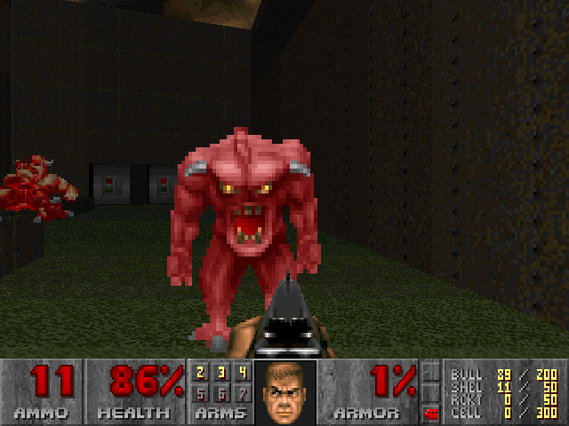
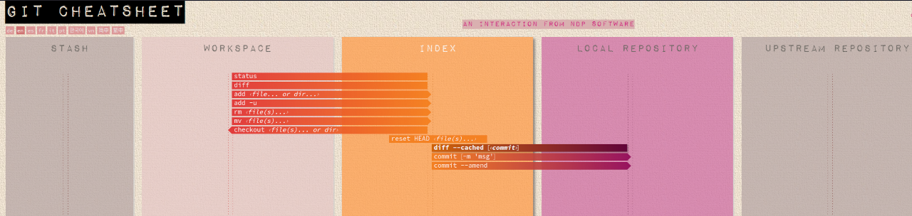
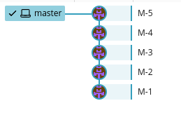
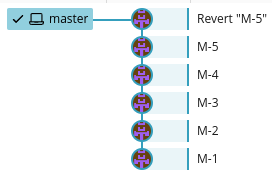
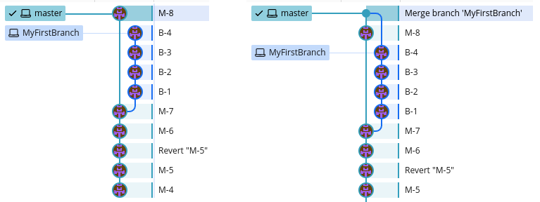
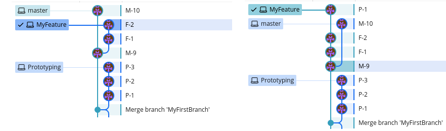
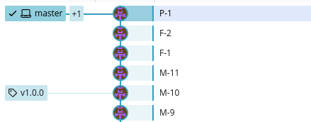
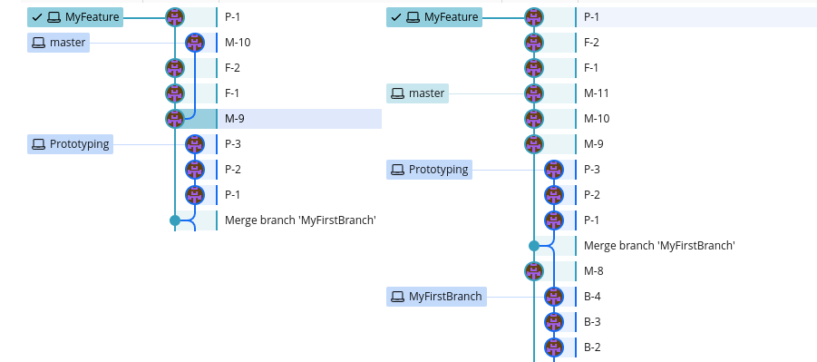
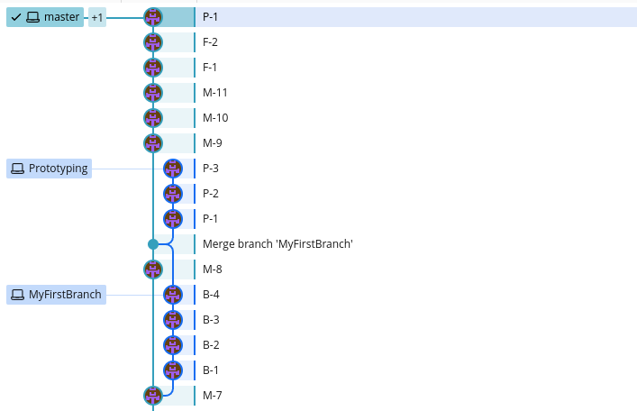

% FLUG: Git, Master the magic time machine
% Thomas Rasmussen
% 16. November, 2023

# About me

Thomas Rasmussen

 [LinkedIn](https://www.linkedin.com/in/thomasbrasmussen/)

I work as a software developer/consultant at [Gennemtænkt IT](https://gennemtaenkt.dk/) \

 _- working primarily with the JVM using [Groovy](https://groovy-lang.org/) and [Grails](https://grails.org/)_

<a href="https://gennemtaenkt.dk/"></a>
<a href="https://www.oracle.com/java/"></a>
<a href="http://groovy-lang.org/"></a>
<a href="https://grails.org/"></a>
<a href="http://flug.dk"></a>

# Git is a distributed version control system


> Development was started by Torvalds in April 2005 when the proprietary source-control management (SCM) system used for Linux kernel development since 2002, BitKeeper, revoked its free license for Linux development
 - [Wikipedia: Git](https://en.wikipedia.org/wiki/Git)

> The decision made in 2002 to use BitKeeper for Linux kernel development was a controversial one. Some, including GNU Project founder Richard Stallman, expressed concern about proprietary tools being used on a flagship free project. While project leader Linus Torvalds and other core developers adopted BitKeeper, several key developers (including Linux veteran Alan Cox) refused to do so, citing the BitMover license, and voicing concern that the project was ceding some control to a proprietary developer
 - [Wikipedia: BitKeeper](https://en.wikipedia.org/wiki/BitKeeper)

# (D)VCS - distributed version control system

> In software engineering, a version control system (also known as revision control) is a class of systems responsible for managing changes to computer programs -- [Wikipedia: VCS](https://en.wikipedia.org/wiki/Version_control)

* [CVS](https://cvs.nongnu.org/)
* [Subversion](https://subversion.apache.org/)
* [Mercurial](https://www.mercurial-scm.org/)
* [Git](https://git-scm.com/)
* ...

# Git

Website: [git-scm.com](https://git-scm.com/) \
Docs: Website: [git-scm.com/docs](https://git-scm.com/docs)

At first Git can look like a monster - it has many commands and many ways of doing things



Try to keep it simple - add, commit, push ...

Use it for maintaining the [Linux](https://kernel.org/) [kernel](https://git.kernel.org/) with thousands of developers - or use it for your own private one developer project

# Git install

Install Git using your OS package manager

Ubuntu
```
$ sudo apt-get install git-all
```

Or dowload and follow instructions from [Git-scm downloads](https://git-scm.com/downloads)

# Git configure

```
$ git config --global user.name "Thomas Rasmussen
$ git config --global user.email "example@example.com"
$ git config --global --list
user.name=Thomas Rasmussen
user.email=example@example.com
```

The config file

```
$ cat ~/.gitconfig
[user]
    name = Thomas Rasmussen
    email = example@example.com
```
...
```
[init]
    defaultBranch = "master" # or "main"
```
...
```
[includeIf "gitdir:~/workspace/gennemtaenkt/"]
    path = ~/.git/gtit.inc
```

[Git config](https://git-scm.com/docs/git-config)

# Create a repository

```
$ mkdir my-project
$ cd my-project
$ git init
Initialized empty Git repository in /home/thomas/my-project/.git/
```

Git bare also creates a repository, but it does not have the working directory

Use this for the "main" repository that developers push and pull to/from

```
$ mkdir my-project.git
$ cd my-project.git
$ git --bare init
```

# The .git folder

```
├── branches
├── config
├── description
├── HEAD
├── hooks
│  ├── applypatch-msg.sample
│  ├── commit-msg.sample
│  ├── post-update.sample
│  ├── pre-applypatch.sample
│  ├── pre-commit.sample
│  ├── prepare-commit-msg.sample
│  ├── pre-rebase.sample
│  └── update.sample
├── info
│  └── exclude
├── objects
│  ├── 09
│  │  └── 2ca1d854a2aa8fdc8a9c19ee8225eb3d6bc2ca
│  ├── 0f
│  │  ├── 5aded2c67fa82f99527d6dd9f236aacaa8b0c9
│  │  └── 74d568bd457904b79eb62052f77525ad6fc3a2
│  ├── 17
│  │  └── fcc1f450cfb471f9ff0c6e936a042fae9f6ffd
│  ├── 4d
│  │  └── ...
│  ├── info
│  └── pack
└── refs
    ├── heads
    │   └── master
    └── tags
```

```
        |09|        ...                          |
git show 092ca1d854a2aa8fdc8a9c19ee8225eb3d6bc2ca
```

> **_NOTE:_**  Don't edit the .git folder!

# Git - Stash, workspace, index, local, upstream



Source: [Git Cheatsheet](https://ndpsoftware.com/git-cheatsheet.html#loc=index;)

# Add files and commit
```
$ vi README.md
$ git status
On branch master

No commits yet

Changes to be committed:
  (use "git rm --cached <file>..." to unstage)
	new file:   README.md

$ git add README
$ git commit -m "Initial commit"

$ git commit -v
```

Editor - use default
```
$ export EDITOR=vi
$ echo $EDITOR
vi
```
Or specify in `~/.gitconfig`
```
...
[core]
    pager = more
    editor = vim
...
```

# Git demo


* git init
* git add \<file\>, git add ., git add \--patch \<file\>
* git status
* git commit, git commit \--amend
* git restore \--staged <file>
* git diff, git diff \--cached
* git mv, git rm
* git push
* git pull vs git fetch
* git stash , git stash pop
* git blame

# Git revert

The `revert` command is one of gits ways of undoing commits



```
$ git revert HEAD
[master 31adeb6] Revert "M-5"
 1 file changed, 5 deletions(-)
```



# Git reset

Reset is another way of undoing and the most complex and versatile of the two

* git reset \--hard, \--mixed, \--soft


```
$ git reset --hard 161655d9ae78360970d2fb61f8f85e0267695b11
HEAD is now at 161655d M-7
```


# Branches

> Branching is the duplication of an object under version control (such as a source code file or a directory tree).\
> Each object can thereafter be modified separately and in parallel so that the objects become different.\
> In this context the objects are called branches.

Source: _[Wikipedia](https://en.wikipedia.org/wiki/Branching_(version_control))_

## Why branches
* Push to main so others can help or review changes
* The master/main branch should always be production ready

# Branch example

```
$ git checkout -b MyFirstBranch
Switched to a new branch 'MyFirstBranch

# Add and commit changes B-1 to B-4 ....

$ git checkout master
# Or use switch
$ git switch master

$ git branch
  MyFirstBranch
* master

# Merge MyFirstBranch INTO master
$ git merge MyFirstBranch
```



# Git merge conflict

Sometimes Git can't merge if files have been edited by multiple people 

```
$ git merge MyBranch

>>> Auto-merging README.md
>>> CONFLICT (content): Merge conflict in README.md
>>> Automatic merge failed; fix conflicts and then commit the result.

...

$ vi README.md

<<<<<<< HEAD
# How to resolve Git Merge Conflict
=======
# How to resolve Git Conflict
>>>>>>> MyBranch

```

# Git cherry-pick 


git cherry-pick - Apply the changes introduced by some existing commits


## Example scenario

I have two branches, a prototype I don't want to merge and a feature branch I occasionally want to merge.

The prototype branch has a file I want.

# Git cherry-pick - fail

```
$ git cherry-pick 0806c57ed3e02f3adf2ae634f8c8664e42acb7f2
CONFLICT (modify/delete): LICENSE.md deleted in HEAD and modified in 0806c57 (P-2).  Version 0806c57 (P-2) of LICENSE.md left in tree.
error: could not apply 0806c57... P-2
hint: After resolving the conflicts, mark them with
hint: "git add/rm <pathspec>", then run
hint: "git cherry-pick --continue".
hint: You can instead skip this commit with "git cherry-pick --skip".
hint: To abort and get back to the state before "git cherry-pick",
hint: run "git cherry-pick --abort"

$ git status
On branch MyFeature
You are currently cherry-picking commit 0806c57.
  (fix conflicts and run "git cherry-pick --continue")
  (use "git cherry-pick --skip" to skip this patch)
  (use "git cherry-pick --abort" to cancel the cherry-pick operation)

Unmerged paths:
  (use "git add/rm <file>..." as appropriate to mark resolution)
        deleted by us:   LICENSE.md

$ git cherry-pick --abort
```
I tried to cherry-pick the P-2 commit which is an edit of a file not present in my current branch - I abort

# Git cherry-pick -- success

And pick the P-1 commit which adds the file
```
$ git cherry-pick 9ec817c24440cdc2afbb660e00d1d183e00c3574
[MyFeature 62a467a] P-1
 Date: Wed Nov 15 21:36:57 2023 +0100
 1 file changed, 3 insertions(+)
 create mode 100644 LICENSE.md
```


[git-cherry-pick](https://git-scm.com/docs/git-cherry-pick)

# Git tag

Tags are a way of tracking milestones (fx. a release or deploy)

```
$ git tag v1.0.0

$ git push --tags
```



[Semantic versioning](https://semver.org/)

# Git log

Show what has been added to the repository and by who 
```
$ git log
```

## Search log 
Search across all branches ignoring case for the word "slides"
```
$ git log --all -i --grep='slides'
```

## Changelog:
```
$ git log --oneline --decorate v0.0.9..v0.1.0
````

# Git rebase onto

```
# rebase feature branch ONTO the master branch
$ git rebase master
```


# Git rebase changes to master

```
$ git checkout master
$ git rebase MyFeature 
Successfully rebased and updated refs/heads/master.
```



Notice difference between `MyFirstBranch` and `MyFeature`

# Git rebase \--interactive

git rebase is a powerful command, and it can be used for many things - fx squashing multiple commits together into one

```
$ git rebase --interactive HEAD~4

# Opens up in editor

pick d209cad M-11
squash 44987a3 F-1
squash 73f1cf7 F-2
squash cae1cb7 P-1

# Rebase 4a9d085..cae1cb7 onto 4a9d085 (4 commands)
#
# Commands:
# p, pick <commit> = use commit
# r, reword <commit> = use commit, but edit the commit message
# e, edit <commit> = use commit, but stop for amending
# s, squash <commit> = use commit, but meld into previous commit
# f, fixup [-C | -c] <commit> = like "squash" but keep only the previous
```

# Git rebase -- a note

**Warning:** Be very careful when rebasing pushed code!

```
$ git push --force
```

Atlassian Git [rebase](https://www.atlassian.com/git/tutorials/rewriting-history/git-rebase) tutorial

[Git rebase](https://git-scm.com/docs/git-rebase)

# Git reflog

> One of the tenets Linus set for Git was that it had to be safe. \
> Meaning you have to be able to get back to any state in the repository - a mechanism for tracking state.

```
$ git reflog
```

> **_NOTE:_** The reflog is garbage collected, typically after 30-90 days ([configurable](https://git-scm.com/docs/git-reflog))  


# Git hooks

Like many other Version Control Systems, Git has a way to fire off custom scripts when certain important actions occur

## Hooks

* Local hooks
* Server side hooks

## Scripts

* bash
* python
* ...

`.git/hooks/pre-rebase`

```
#!/bin/sh

# Disallow all rebasing
echo "pre-rebase: Rebasing is dangerous. Don't do it."
exit 1
```

[Git hooks](https://git-scm.com/docs/githooks)

# Git archive

```
$ git archive --output=archive.tar --format=tar master
```

Specify files to be excluded in the `.gitattributes` file

Example:
```
.gitattributes  export-ignore
.gradle		    export-ignore
.idea		    export-ignore
.gitignore 	    export-ignore
src/test 	    export-ignore
```

Make sure to commit the `.gitattributes` file, or git archive won't pick up the settings

The [gitattributes](https://git-scm.com/book/en/v2/Customizing-Git-Git-Attributes) can do much more...

# Git bisect

[git-bisect](https://git-scm.com/docs/git-bisect) - Use binary search to find the commit that introduced a bug

```
# HEAD is broken and 893b28d is last known working commit
$ git bisect start HEAD 893b28d --
$ git bisect run ./gradlew check
```

This example uses Gradle, but any testsuite or script that returns an ERROR or OK will do \
Fx a bash script returning a non-zero value


# Git and binary files

Git can store binary files just fine, but editing them typically causes the repo to grow the size of the file since it cant diff efficiently.

If many big binary files consider Git Annex or LFS

* [Git annex](https://git-annex.branchable.com/) -- allows managing large files with git, without storing the file contents in git
* [Git LFS](https://git-lfs.com/) -- An open source Git extension for versioning large files

# submodules

> It often happens that while working on one project, you need to use another project from within it

A way of including other Git projects in your Git repo - but you don't have a copy of the repo, you have a reference to
a commit hash in the other repo.

If the remote repo changes, your version does not until you update
```
$ git submodule update --init --recursive
```

Setting are stored in `.gitmodules`
```
[submodule "src/main/java/some-other-project"]
path = src/main/java/some-other-project
url = https://github.com/dauer/src/java/some-other-project.git
 ...
 ```
[Git submodules](https://git-scm.com/book/en/v2/Git-Tools-Submodules)

# Sparse index

> The sparse-checkout feature allows users to focus a working directory on a subset of the files at HEAD

[Sparse-index](https://git-scm.com/docs/sparse-index)

# IDE and GUI

## IDE support

* IntelliJ
* VSCode
* Vim
* ...

## GUI
* GitKraken
* gitg
* gitk
* ...

# Git & GPG

[Signing your work](https://git-scm.com/book/en/v2/Git-Tools-Signing-Your-Work)

> If you’re taking work from others on the internet and want to verify that commits are actually from a trusted source

# Links & resources

* [Git](https://git-scm.com/)
* [Git book](https://git-scm.com/book/en/v2)
* [Git GUI](https://git-scm.com/downloads/guis/)
* [Atlassian Git tutorial](https://www.atlassian.com/git/tutorials)
* [GitHub blog](https://github.blog/)
* Hosted Git
  * [GitHub](https://github.com/)
  * [GitLab](https://about.gitlab.com/)
  * [BitBucket](https://bitbucket.org/)
* Self-hosted
  * [Gitea](https://about.gitea.com/)
  * [Baeldung - Git server setup](https://www.baeldung.com/linux/git-server-set-up)
* [GitKraken](https://www.gitkraken.com/)
  * [GitLens](https://www.gitkraken.com/gitlens) for VS Code


