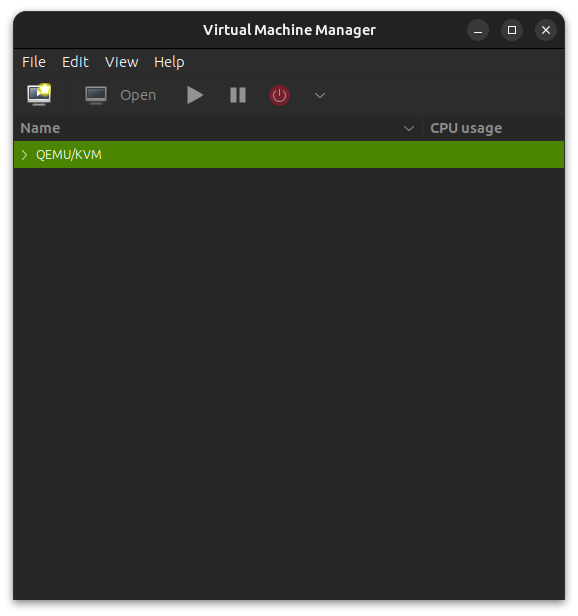
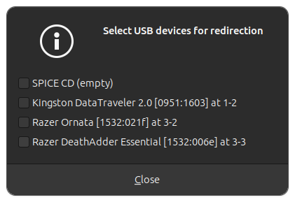
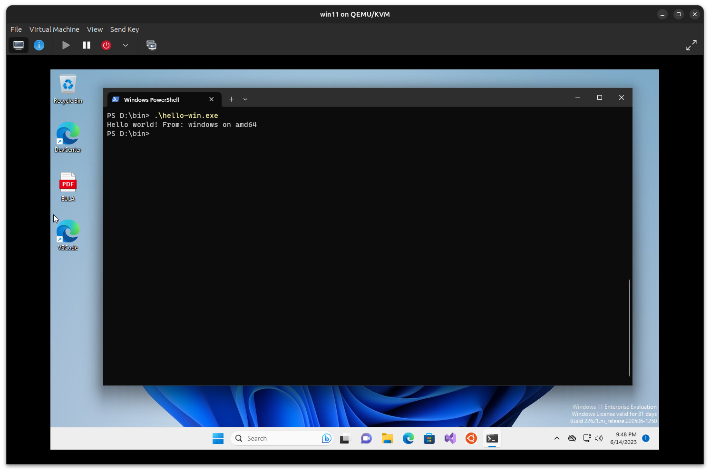

% FLUG: QEMU lightning talk
% Thomas Rasmussen
% 15. June, 2023

# About me

Thomas Rasmussen

 [LinkedIn](https://www.linkedin.com/in/thomasbrasmussen/)

I work as a software developer/consultant at [Gennemtænkt IT](https://gennemtaenkt.dk/) \

 _- working primarily on the JVM using [Groovy](https://groovy-lang.org/) and [Grails](https://grails.org/)_

# QEMU

* __Full-system emulation__ - Run operating systems for any machine, on any supported architecture
* __User-mode emulation__ - Run programs for another Linux/BSD target, on any supported architecture
* __Virtualization__ - Run KVM and Xen virtual machines with near native performance

[Qemu.org](https://www.qemu.org/)

# Install

## Pre install

Verify virtualization is enabled

    $ egrep -c '(vmx|svm)' /proc/cpuinfo 
    12

vmx = Intel

svm = AMD

If the value is zero check your BIOS settings...

## Installing

Install QEMU (the virtualization part)

    $ sudo apt install qemu-kvm 
 
For emulating different CPU architectures install

    $ sudo apt install qemu-user

# Run applications for different CPU architectures

- X86
- ARM 32
- ARM 64 (aarch64)
- MIPS
- PowerPC
- RISC-V
- S390x
- Sparc 32
- Sparc 64
- [System targets](https://www.qemu.org/docs/master/system/targets.html) ...

# Examples of different architectures

My system is an Intel/AMD X86_64 based system running Ubuntu

    $ uname -a
    Linux 6.2.0-20-generic #20-Ubuntu SMP PREEMPT_DYNAMIC Thu Apr  6 2023 x86_64 x86_64 x86_64 GNU/Linux

A simple "hello world" program written in [Go-lang](https://go.dev/) 

[Hello world in Go-lang](../examples/golang/src/hello.go.html) - download [src](../examples/golang/src/hello.go)

 and cross compiled for different CPU architectures and operating systems:

[Script for compiling](../examples/golang/compile.sh.html) - download [src](../examples/golang/compile.sh)

    $ file hello-arm64
    hello-arm64: ELF 64-bit LSB executable, ARM aarch64, version 1 (SYSV), statically linked, Go BuildID=ZgcKY7b7tAM4fTfkEmcR..., not stripped

    $ file hello-arm32
    hello-arm32: ELF 32-bit LSB executable, ARM, EABI5 version 1 (SYSV), statically linked, Go BuildID=6mnYLXKGBcNxSMYhaM56..., not stripped

    $ file hello-x84
    hello: ELF 64-bit LSB executable, x86-64, version 1 (SYSV), statically linked, Go BuildID=e-dT_OvB22dfzXKqhiNI..., not stripped

    $ file hello-win.exe
    hello-win.exe: PE32+ executable (console) x86-64 (stripped to external PDB), for MS Windows, 13 sections

# Examples of different architectures - running ...

Running the different "hello world" programs

    $ ./hello-x64
    Hello world! From: linux on amd64

    $ ./hello-arm32 
    bash: ./hello-arm32: cannot execute binary file: Exec format error

    $ qemu-arm hello-arm32 
    Hello world! From: linux on arm

    $ qemu-arm hello-arm64
    qemu-arm: hello-arm64: Invalid ELF image for this architecture

    $ qemu-aarch64 hello-arm64
    Hello world! From: linux on arm64

    $ ./hello-win.exe 
    bash: ./hello-win.exe: cannot execute binary file: Exec format error

    $ qemu-x86_64 hello-win.exe 
    Error while loading hello-win.exe: Exec format error

# Running other full systems

QEMU does more than letting us run applikation written for different CPU architectures it also lets us run other complete Operating Systems

## Kubuntu

Kubuntu 22.04.2 Desktop AMD64 ISO

[Get Kubuntu](https://kubuntu.org/getkubuntu/)

## Windows

Get a Windows 11 development environment

[Download a virtual machine](https://developer.microsoft.com/en-us/windows/downloads/virtual-machines/)

I downloaded the `WinDev2305Eval.VirtualBox.zip` for [Virtualbox](https://www.virtualbox.org/)

QEMU doesn't run Virtualbox `.ova` files, they need to be converted from `.ova` to `.qcow2` (QEMU [Copy-On-Write version 2](https://access.redhat.com/documentation/en-us/red_hat_virtualization/4.3/html/technical_reference/qcow2)) format. \

    $ unzip WinDev2305Eval.VirtualBox.zip
    $ tar -xvf WinDev2305Eval.ova
    $ ls
      WinDev2305Eval.ova
      WinDev2305Eval-disk001.vmdk
      WinDev2305Eval.ovf
    $ qemu-img convert WinDev2305Eval-disk001.vmdk WinDev2305Eval.qcow2 -O qcow2

[How to convert ova image to qcow2](https://tekbyte.net/how-to-convert-ova-image-to-qcow2-qemu-and-virt-manager/)

# Running: Kubuntu

Create `.img` file (virtual harddisk)

    $ qemu-img create -f qcow2 Image.img 10G

Using the cli

    $ qemu-system-x86_64 -enable-kvm -cdrom ../iso/kubuntu-22.04.2-desktop-amd64.iso -boot menu=on \
        -drive file=Image.img \
        -m 4G -cpu host -smp 4 -vga virtio -display sdl,gl=on \

-m memory/RAM

-cpu host - Host CPU og guest are the same in this case so no emulation needed

-smp number of CPU cores 

-vga better graphichs through virtio

-display sdl gl=on enables OpenGL for smoother graphics

_And many many more options..._

# Running: Windows 11

We'll use the QEMU GUI this time

Install

    $ sudo apt install virt-manager

Run

    $ virt-manager

# Create virtual machine

# Locate ISO or disc image

virt-manager looks for images at this location

    /var/lib/libvirt/images

# Select disc image

Select the virtual machine you want to run

# Windows 11

# Shared files using USB sticks

From the Virt-Manager menu select

    Virtual Machine > Redirect USB device

And select the USB drive from the list

# Runnig the hello-win.exe 

We can now run the for Windows compiled "hello world" program

# Shared folders between host and guest OS

It is also possible to mount folders on the host machine into the guest machine
using 9p virtio as the transport for sharing files

[Example Sharing Host files with the Guest](https://www.linux-kvm.org/page/9p_virtio)

# Snapshots

## break - restore - retry...

QEMU supports snapshots - if you break something while testing just go back to previous snapshot

QEMU also supports temporary snapshots, where any changes made to the virtual machine while it is running are written to temporary files

[Create snapshot](https://wiki.qemu.org/Documentation/CreateSnapshot)

# Other use cases

Coreboot - testing and developing open source boot firmware

[Coreboot test image using QEMU](https://doc.coreboot.org/tutorial/part1.html#test-the-image-using-qemu)

[Coreboot QEMU()]https://www.coreboot.org/QEMU)

[Coreboot, u-root and Systemboot](https://github.com/linuxboot/book/blob/master/coreboot.u-root.systemboot/README.md)

# Help...

CTRL + ALT + G : Get your mouse back from the emulator

CTRL + ALT F : Fullscreen emulator window

# Links & resources

* [QEMU](https://www.qemu.org/)
* [QEMU: A proper guide!](https://www.youtube.com/watch?v=AAfFewePE7c)
* [Veronica Explains - QEMU/KVM for absolute beginners](https://www.youtube.com/watch?v=BgZHbCDFODk)
* [KVM - Kernel Virtual Machine](https://www.linux-kvm.org/)
